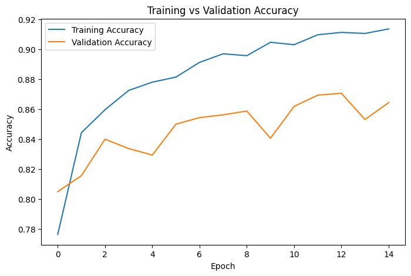
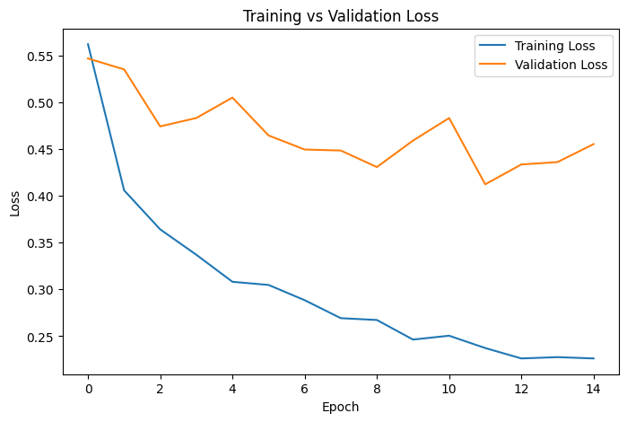
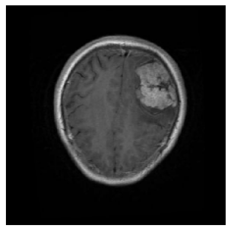

# Brain Tumor Classification using EfficientNetB0

## Project Overview

This project classifies brain MRI images into four categories using Deep Learning and Transfer Learning with EfficientNetB0.

The model was trained on the Brain Tumor MRI Dataset and fine-tuned to improve classification performance.

---

## Features

- Brain MRI Classification
- EfficientNetB0 Transfer Learning
- Data Augmentation
- Fine-Tuning
- Confusion Matrix
- Classification Report
- Single Image Prediction
- Model Saving and Loading

---

## Dataset

Brain Tumor MRI Dataset

Dataset Link:

https://www.kaggle.com/datasets/masoudnickparvar/brain-tumor-mri-dataset

Classes:

- Glioma
- Meningioma
- No Tumor
- Pituitary

---

## Technologies Used

- Python
- TensorFlow
- Keras
- EfficientNetB0
- NumPy
- Matplotlib
- Seaborn
- Scikit-learn
- Google Colab

---

## Project Workflow

1. Load MRI Dataset
2. Data Preprocessing
3. Data Augmentation
4. Build EfficientNetB0 Model
5. Train Model
6. Fine-Tune Model
7. Evaluate Model
8. Predict MRI Images

---

## Model Architecture

- EfficientNetB0
- GlobalAveragePooling2D
- Dense(128)
- Dropout
- Dense(4, Softmax)

---

## Results

Test Accuracy:

**85.19%**

---

## Project Images

### Training Accuracy

---

### Training Loss

---

### Confusion Matrix

---

### Sample Prediction

---

## Trained Model

The trained model is not included in this repository because of its large size.

---

## Future Improvements

- Grad-CAM
- Streamlit Deployment
- Hyperparameter Tuning
- Docker Deployment

---

## Author

**Raghava**